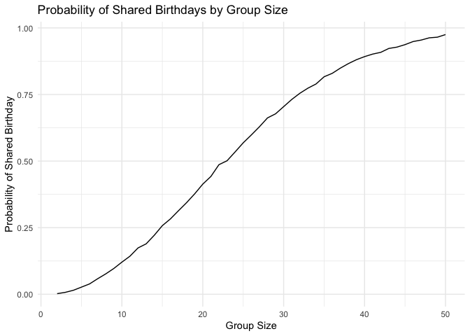
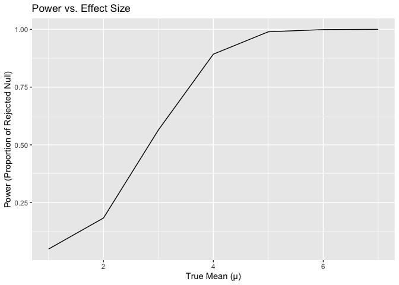
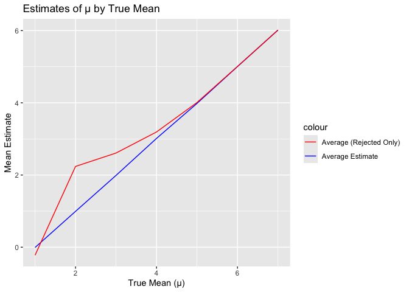
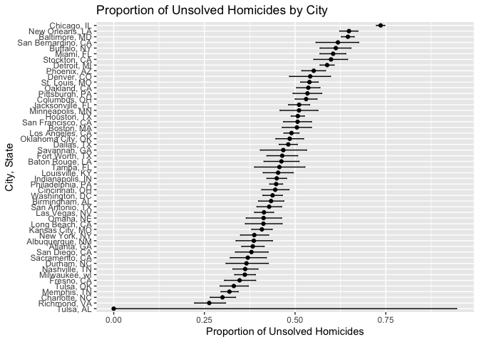

p8105_hw5_wz2722
================
wentao zhou
2024-11-13

Problem 1.

``` r
# Define a function to simulate birthdays and check for duplicates
simulate_birthdays <- function(n) {
  birthdays <- sample(1:365, n, replace = TRUE)
  return(length(unique(birthdays)) < n)
}

# Run the simulation 10,000 times for group sizes from 2 to 50
set.seed(42)
group_sizes <- 2:50
results <- sapply(group_sizes, function(n) {
  mean(replicate(10000, simulate_birthdays(n)))
})

# Plot the probability
library(ggplot2)
data <- data.frame(GroupSize = group_sizes, Probability = results)

ggplot(data, aes(x = GroupSize, y = Probability)) +
  geom_line() +
  labs(title = "Probability of Shared Birthdays by Group Size",
       x = "Group Size",
       y = "Probability of Shared Birthday") +
  theme_minimal()
```

<!-- -->
Comment: The Plot shows that the probability of at least two people
sharing a birthday increases rapidly as the team size increases. When
the group reaches around 23 people, there is a more than 50% chance of
sharing birthdays.

Problem 2.

``` r
# Simulate datasets and test
library(broom)
library(dplyr)
```

    ## 
    ## Attaching package: 'dplyr'

    ## The following objects are masked from 'package:stats':
    ## 
    ##     filter, lag

    ## The following objects are masked from 'package:base':
    ## 
    ##     intersect, setdiff, setequal, union

``` r
n <- 30
sigma <- 5
mu_values <- 0:6
alpha <- 0.05
simulations <- 5000

results <- lapply(mu_values, function(mu) {
  data <- replicate(simulations, {
    x <- rnorm(n, mean = mu, sd = sigma)
    t_test <- t.test(x, mu = 0)
    broom::tidy(t_test)
  }, simplify = FALSE)
  bind_rows(data)
}) %>%
bind_rows(.id = "mu") %>%
mutate(mu = as.numeric(mu))
```

``` r
# Calculate Power 
power_results <- results %>%
  group_by(mu) %>%
  summarise(power = mean(p.value < alpha))

ggplot(power_results, aes(x = mu, y = power)) +
  geom_line() +
  labs(title = "Power vs. Effect Size",
       x = "True Mean (μ)",
       y = "Power (Proportion of Rejected Null)")
```

<!-- -->
Effect size and power: As the actual effect size increases, the tested
power also increases, indicating a higher likelihood of detecting the
effect.

``` r
# Plot Mean Estimate of μ
estimates <- results %>%
  group_by(mu) %>%
  summarise(mean_mu_hat = mean(estimate),
            mean_mu_hat_rejected = mean(estimate[p.value < alpha]))

ggplot(estimates, aes(x = mu)) +
  geom_line(aes(y = mean_mu_hat, color = "Average Estimate")) +
  geom_line(aes(y = mean_mu_hat_rejected, color = "Average (Rejected Only)")) +
  labs(title = "Estimates of μ by True Mean",
       x = "True Mean (μ)",
       y = "Mean Estimate") +
  scale_color_manual(values = c("Average Estimate" = "blue", "Average (Rejected Only)" = "red"))
```

<!-- --> The
estimated value of μ: The average estimated value of 𝜇 in all samples is
close to the true value, but when only considering tests with zero
values rejected, the average value is often slightly higher. This is due
to selection bias, as samples rejected with zero values often have
higher observed effect sizes by chance.

Problem 3.

``` r
library(readr)
library(dplyr)
homicides <- read.csv("homicide-data.csv")
```

Description: Column: 1.City: The city where the murder occurred.
2.State: The state where the murder occurred. 3.Disposition: The status
of the case (e.g. “closed without arrest”, “not arrested/not arrested”,
“closed with arrest”). 4.Other sections may include detailed information
such as the age of the victim and the type of weapon used.

Disposal value: The key categories related to ‘unresolved homicide
cases’ are: 1.Close without arrest 2.Open/No Arrest

Part 1.Create a city_state Variable and Summarize

``` r
# Create city_state variable
homicides <- homicides %>%
  mutate(city_state = paste(city, state, sep = ", "))

# Summarize data within cities
city_summary <- homicides %>%
  group_by(city_state) %>%
  summarise(
    total_homicides = n(),
    unsolved_homicides = sum(disposition %in% c("Closed without arrest", "Open/No arrest"))
  )
```

Part 2.Proportion Test for Baltimore, MD

``` r
# Filter data for Baltimore, MD
baltimore_data <- city_summary %>%
  filter(city_state == "Baltimore, MD")

# Perform proportion test
baltimore_test <- prop.test(
  baltimore_data$unsolved_homicides,
  baltimore_data$total_homicides
)

# Use broom::tidy to extract results
library(broom)
baltimore_results <- tidy(baltimore_test)

# Display estimate and confidence intervals
baltimore_results %>%
  select(estimate, conf.low, conf.high)
```

    ## # A tibble: 1 × 3
    ##   estimate conf.low conf.high
    ##      <dbl>    <dbl>     <dbl>
    ## 1    0.646    0.628     0.663

Part 3. For all cities

``` r
library(purrr)
library(tidyr)

# Apply proportion test for all cities
city_proportions <- city_summary %>%
  mutate(
    test_results = map2(
      unsolved_homicides,
      total_homicides,
      ~ prop.test(.x, .y) %>% tidy()
    )
  ) %>%
  unnest(test_results, names_sep = "_")
```

    ## Warning: There was 1 warning in `mutate()`.
    ## ℹ In argument: `test_results = map2(...)`.
    ## Caused by warning in `prop.test()`:
    ## ! Chi-squared approximation may be incorrect

``` r
# Select relevant columns for clarity
city_proportions <- city_proportions %>%
  select(
    city_state, 
    total_homicides, 
    unsolved_homicides, 
    estimate = test_results_estimate, 
    conf.low = test_results_conf.low, 
    conf.high = test_results_conf.high
  ) %>%
  arrange(desc(estimate))

# Display the result
head(city_proportions)
```

    ## # A tibble: 6 × 6
    ##   city_state      total_homicides unsolved_homicides estimate conf.low conf.high
    ##   <chr>                     <int>              <int>    <dbl>    <dbl>     <dbl>
    ## 1 Chicago, IL                5535               4073    0.736    0.724     0.747
    ## 2 New Orleans, LA            1434                930    0.649    0.623     0.673
    ## 3 Baltimore, MD              2827               1825    0.646    0.628     0.663
    ## 4 San Bernardino…             275                170    0.618    0.558     0.675
    ## 5 Buffalo, NY                 521                319    0.612    0.569     0.654
    ## 6 Miami, FL                   744                450    0.605    0.569     0.640

Part 4. Plotting Proportions with Confidence Intervals

``` r
library(ggplot2)

# Create plot
ggplot(city_proportions, aes(x = reorder(city_state, estimate), y = estimate)) +
  geom_point() +
  geom_errorbar(aes(ymin = conf.low, ymax = conf.high), width = 0.2) +
  coord_flip() +
  labs(
    title = "Proportion of Unsolved Homicides by City",
    x = "City, State",
    y = "Proportion of Unsolved Homicides"
  )
```

<!-- -->
